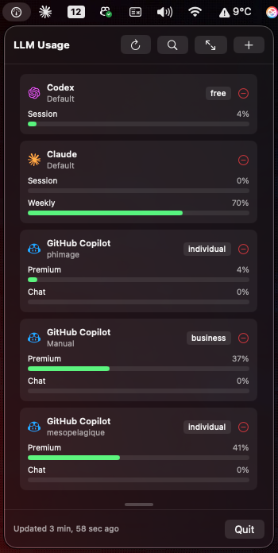

# LLMUsage

LLMUsage is an all-in-one solution for managing and monitoring your LLM service accounts on macOS. It consists of a **Swift library**, a **CLI tool**, and a **macOS Menu Bar application**.

## Features

- **Multi-token accounts** — Store multiple tokens per service (personal, work, etc.)
- **Auto-discovery** — Finds existing tokens from Claude, Copilot, Cursor, Windsurf, Codex, Antigravity
- **Secure storage** — macOS Keychain via Security framework
- **Usage fetching** — API clients for each service
- **Swift 6 / async-await** — Full concurrency support

## 🖥️ Menu Bar App (macOS)

Monitor your LLM usage directly from your macOS menu bar. The app provides real-time visibility into your session and usage across multiple services.



**Features:**
- Quick overview of all accounts and current usage.
- Auto-refresh and manual refresh support.
- One-click token discovery.
- Detachable window for persistent monitoring.

To run the menu bar app from source:
```bash
swift run llmusage-menubar
```

## ⌨️ CLI Tool

Manage your accounts and fetch usage directly from the terminal.

```bash
# 1. Discover and import tokens
swift run llmusage-cli discover

# 2. Show accounts and fetch usage
swift run llmusage-cli account

# 3. Manual management
swift run llmusage-cli add claude sk-ant-xxx "My Personal Key"
swift run llmusage-cli remove claude "My Personal Key"
```

Example output:
```
🔍 LLMUsage - Discovering tokens...
✅ Found and imported 3 account(s)

📋 Listing 3 account(s)...
📦 Claude
   Session: [████████████░░░░░░░░] 60%
```

## 📦 Swift Library

LLMUsage can be integrated into your own Swift projects as a package.

### Installation

Add to your `Package.swift`:

```swift
dependencies: [
    .package(url: "https://github.com/phimage/LLMUsage.git", from: "0.1.0")
]
```

### Usage

```swift
import LLMUsage

// Initialize
let llm = LLMUsage()
try await llm.setup()

// Discover existing tokens
let imported = try await llm.discoverAndImport()
print("Found \(imported.count) accounts")

// Fetch usage for all accounts
let results = await llm.fetchAllUsage()
for result in results {
    switch result {
    case .success(let usage):
        print("\(usage.account.service): \(usage.metrics.count) metrics")
    case .failure(let error):
        print("Error: \(error)")
    }
}
```

## Supported Services

| Service | Discovery | API |
|---------|-----------|-----|
| Claude | `~/.claude/.credentials.json`, Keychain | ✓ |
| Copilot | `gh:github.com` Keychain | ✓ |
| Cursor | SQLite `state.vscdb` | ✓ |
| Windsurf | SQLite `state.vscdb` | ✓ |
| Codex | `~/.config/codex/auth.json` | ✓ |
| Antigravity | Process discovery (language server) | ✓ |

## Requirements

- macOS 14+
- Swift 6.0+

## License

MIT
